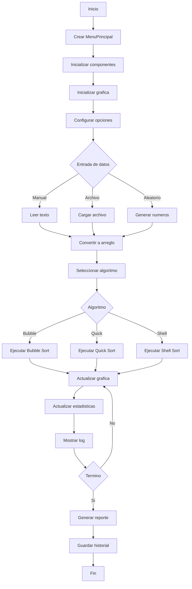

# Diagrama de flujo - Visualizador de Algoritmos de Ordenamiento


## Menu principal


```mermaid
flowchart TD

A[Inicio] --> B[Crear MenuPrincipal]
B --> C[Inicializar componentes]
C --> D[Inicializar grafica]
D --> E[Configurar opciones]

E --> F{Entrada de datos}

F -->|Manual| G[Leer texto]
F -->|Archivo| H[Cargar archivo]
F -->|Aleatorio| I[Generar numeros]

G --> J[Convertir a arreglo]
H --> J
I --> J

J --> K[Seleccionar algoritmo]
K --> L{Algoritmo}

L -->|Bubble| M[Ejecutar Bubble Sort]
L -->|Quick| N[Ejecutar Quick Sort]
L -->|Shell| O[Ejecutar Shell Sort]

M --> P[Actualizar grafica]
N --> P
O --> P

P --> Q[Actualizar estadisticas]
Q --> R[Mostrar log]

R --> S{Termino}

S -->|No| P
S -->|Si| T[Generar reporte]
T --> U[Guardar historial]
U --> V[Fin]
```

## Main

```mermaid

```


